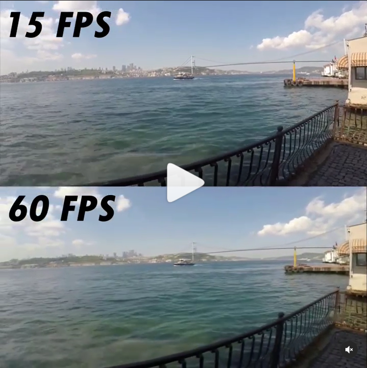

# fps-boost

Düşük kare hızındaki videolarınızı 60 FPS kare hızına çıkartır.
En iyi farkı görmek için mutlaka düşük kare hızlı videolar kullanın.
İlk seferde olmaz ise oluşan dosyayı tekrar işlemden geçirebilirsiniz. (Bunun için out klasörünü silmelisiniz.).

Kullanım:
İşlenecek dosyanın ismini "input.mp4" olacak şekilde ayarlayın.  
Main.py dosyasını çalıştırın.  
Oluşacak "akici.mp4" 60 FPS kare hızına çıkmış olacaktır.  

------------------------------------

Always use low frame rate videos to see the best difference.
If it does not happen the first time, you can process the resulting file again. (You must delete the "out" folder for this).

Set your file name to "input.mp4".  
Run Main.py.  
Output file "akici.mp4" is now 60 FPS.
